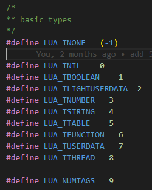
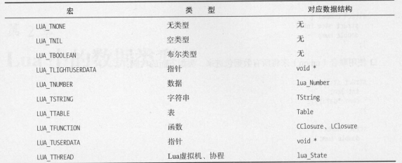
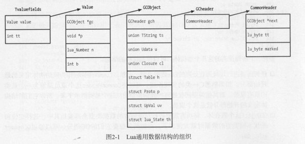

Lua 中有八种基本类型：nil、boolean、number、string、function、userdata、 thread 、table。

  

其中 LUA TLIGHTUSERDATA 和LUA TUSERDATA 一样 ，对应的都是void ＊指针，区别在于前者的分配释放由 Lua外部的使用者来完成，而后者则是通过Lua 内部来完成的 换言之，前者不需要Lua去关心它的生存期，由使用者自己去关注，后者则反之

  

