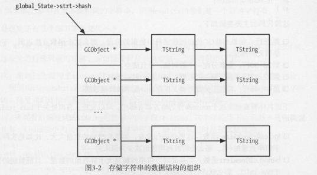

每个存放 字符串的变量，实际上存放的并不是一份字符串的数据副本，而是这份字符串数据的引用 在这个理念下，每当新创建一个字符串时，首先都会去检查当前系统中是否已经有一份相同的字符串数据了 如果存在的话就直接复用，将引用指向这个已经存在的字符串数据，否则就重新创建出一份新的字符串数据

因此，字符串在Lua中是一个不可变的数据，改变一个字符串变量的数据并不会影响原来字符串的数据

---

这种方案的好处：
进行字符串数据的比较和查找操作时，性能会提升不少，只需要一次整数的比较
空间优化，多份相同的字符串在整个系统中只存在一份副本

缺点：
创建一个新的字符串时，首先会检查系统中是否有相同的数据，只有不存在的情况下才创建，这与直接创建字符串相比，多了一次查找过程

---

在Lua虚拟机中存在一个全局的数据区，用来存放当前系统中的所有字符串
```
/**
global state', shared by all threads of this state(被本state所属的threads共享,言外之意，还可以有第N+1个state,其是一个完全独立的lua'state(包含独享的global_state和其独享的threads))

*/

typedef struct global_State {

  lua_Alloc frealloc;   /* function to reallocate memory */
  void *ud;           /* auxiliary data to `frealloc' */
  stringtable strt;   /* hash table for strings */
  lu_byte gcstate;    /* state of garbage collector */
  lu_byte currentwhite; /* atomic() 原子扫描完毕时，切换此值 */
  GCObject *rootgc;   /* list of all collectable objects */
  GCObject *gray;     /* list of gray objects */
  GCObject *grayagain;  /* list of objects to be traversed atomically */
  GCObject *weak;     /* list of weak tables (to be cleared)，propagate阶段处理的weak-table被放入此链表(gc过程中weak-attribute还可能发生变化的)，等待最后atomic处理， */
  GCObject *tmudata;    /* last element of list of userdata to be GC */
  int     sweepstrgc; /* position of sweep in `strt' */
  GCObject **sweepgc;   /* position of sweep in `rootgc' */
  lu_mem totalbytes;    /* number of bytes currently allocated */
  lu_mem GCthreshold; /* 临界点（开始扫描的临界点？） */
  lu_mem estimate;    /* an estimate(估计) of number of bytes actually in use */
  lu_mem gcdept;    /* how much GC is `behind schedule' */
  int gcpause;      /* size of pause between successive GCs */
  int gcstepmul;      /* GC `granularity/步伐速度' */
  lua_CFunction panic;  /* to be called in unprotected errors */
  TValue l_registry;
  struct lua_State *mainthread;
  UpVal uvhead;  /* head of double-linked list of all open upvalues */
  struct Table  *mt[NUM_TAGS];  /* metatables for basic types */
  TString     *tmname[TM_N];  /* array with tag-method names */
  Mbuffer buff;  /* temporary buffer for string concatentation(级联) */
} global_State;
```

```
typedef struct stringtable {
  GCObject **hash;
  lu_int32 nuse;    /* number of elements 表中元素总数 */
  int size;     /* 哈希桶的高度 */
} stringtable;
```
  

```
/*
** String headers for string table
*/

typedef union TString {
  L_Umaxalign dummy;    /* ensures maximum alignment for strings */
  struct {
    CommonHeader;
    lu_byte reserved; /* 是否为保留字(eg:语言关键字), 为1将不会被gc系统回收 */
    unsigned int hash;  /* hash值 */
    size_t len;     /* 不包含lua额外申请的放在数组最后面的\0 */
  } tsv;
} TString;

```


  

---

resize函数实现：
```
void luaS_resize (lua_State *L, int newsize) {
  GCObject **newhash;
  stringtable *tb;
  int i;
  if (G(L)->gcstate == GCSsweepstring)
    return;  /* cannot resize during GC traverse */
  newhash = luaM_newvector(L, newsize, GCObject *); // 分配一个新的散列桶，一个数组，数组元素类型是GCObject*
  tb = &G(L)->strt;
  for (i=0; i<newsize; i++) newhash[i] = NULL; / 清空
  /* rehash */
  for (i=0; i<tb->size; i++) {
    GCObject *p = tb->hash[i];
    while (p) {  /* for each node in the list */
      GCObject *next = p->gch.next;  /* save next */
      unsigned int h = gco2ts(p)->hash;//找到p的hash值
      int h1 = lmod(h, newsize);  /* new position 重新计算p在散列桶的位置，没有重新计算hash，没必要 */
      lua_assert(cast_int(h%newsize) == lmod(h, newsize));
      p->gch.next = newhash[h1];  /* chain it 前向插入*/
      newhash[h1] = p;
      p = next;
    }
  }

  luaM_freearray(L, tb->hash, tb->size, TString *);
  tb->size = newsize;
  tb->hash = newhash;
}
```

调用时机：
lgc.c/checkSizes 函数： 这里会进行检查，如果此时桶的数量太大，比如是实际存放的字符串数量的4倍，那么会将散列桶数组减少为原来的一半

lstring.c/newlstr 函数 ：如果此时字符串的数量大于桶数组的数量，且桶数组的数量小于MAX_INT/2 ，那么就进行翻倍的扩容

---


newstr实现:
```
/* 不像lua5.3,此版本不区分长/短字符串
** 字符串做了序列化(唯一)处理，且没有保存在global_state->gc列表上
** l:不包含结尾的\0
*/
static TString *newlstr (lua_State *L, const char *str, size_t l,
                                       unsigned int h) {
  TString *ts;
  stringtable *tb;
  if (l+1 > (MAX_SIZET - sizeof(TString))/sizeof(char))
    luaM_toobig(L);
  ts = cast(TString *, luaM_malloc(L, (l+1)*sizeof(char)+sizeof(TString)));//字符串长度+\0 + TString
  ts->tsv.len = l;
  ts->tsv.hash = h;
  ts->tsv.marked = luaC_white(G(L));
  ts->tsv.tt = LUA_TSTRING;
  ts->tsv.reserved = 0;
  memcpy(ts+1, str, l*sizeof(char));//跳过TString，把字符串拷贝到后面
  ((char *)(ts+1))[l] = '\0';  /* ending 0 */
  tb = &G(L)->strt;
  h = lmod(h, tb->size);//找到散列通的下标
  /* 插入链表 */
  ts->tsv.next = tb->hash[h];  /* chain new entry 前向插入，省去了遍历到链表队尾的时间*/
  tb->hash[h] = obj2gco(ts);
  tb->nuse++;
  /* 这里装载因子为1 */
  if (tb->nuse > cast(lu_int32, tb->size) && tb->size <= MAX_INT/2)
    luaS_resize(L, tb->size*2);  /* too crowded(拥挤) */
  return ts;
}

TString *luaS_newlstr (lua_State *L, const char *str, size_t l) {
  GCObject *o;
  unsigned int h = cast(unsigned int, l);  /* seed */
  size_t step = (l>>5)+1;  /* if string is too long, don't hash all its chars, save cpu cycle */
  size_t l1;
  /* hash完全独立于str自身 */
  /* compute hash 在字符串非常大的时候，不需要逐位来进行散列值的计算，而仅需要每步长单位取一个字符就可以了*/
  for (l1=l; l1>=step; l1-=step)  
    h = h ^ ((h<<5)+(h>>2)+cast(unsigned char, str[l1-1]));
  for (o = G(L)->strt.hash[lmod(h, G(L)->strt.size)]; /*lmod(h, G(L)->strt.size) 下标取余，防止h超出数组大小*//* luaS_resize()已在此函数前被调用(f_luaopen()中), resize初始化了hash桶，否则size==0，segamentFault  */
       o != NULL;
       o = o->gch.next) {
    TString *ts = rawgco2ts(o);
    if (ts->tsv.len == l && (memcmp(str, getstr(ts), l) == 0)) {
      /* string may be dead */
      if (isdead(G(L), o))  /* 能复用则复用，避免了重复构造 */
      changewhite(o);
      return ts;
    }
  }
  return newlstr(L, str, l, h);  /* not found */
}
```

---

保留字的初始化：
```
/* ORDER RESERVED */
const char *const luaX_tokens [] = {
    "and", "break", "do", "else", "elseif",
    "end", "false", "for", "function", "if",
    "in", "local", "nil", "not", "or", "repeat",
    "return", "then", "true", "until", "while",
    "..", "...", "==", ">=", "<=", "~=",
    "<number>", "<name>", "<string>", "<eof>",
    NULL
};

```
  
---

构建出关键字
```
void luaX_init (lua_State *L) {
  int i;
  for (i=0; i<NUM_RESERVED; i++) {
    TString *ts = luaS_new(L, luaX_tokens[i]);
    luaS_fix(ts);  /* reserved words are never collected */
    lua_assert(strlen(luaX_tokens[i])+1 <= TOKEN_LEN);
    ts->tsv.reserved = cast_byte(i+1);  /* reserved word */
  }
}
```

  
